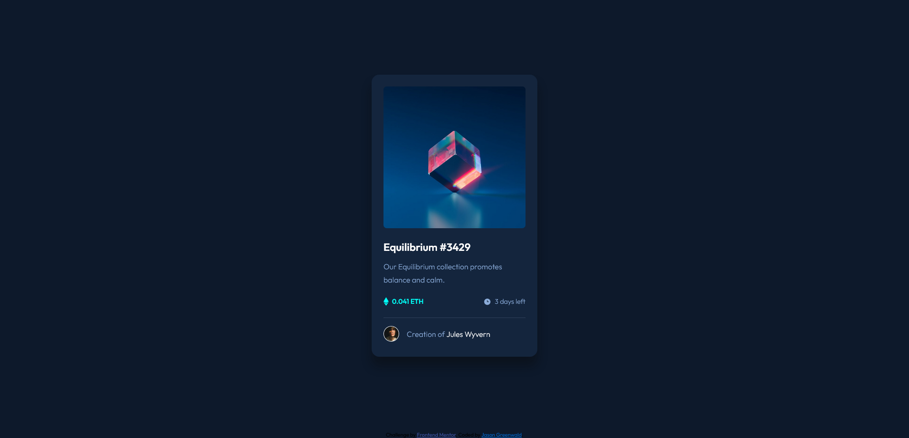

# Frontend Mentor - NFT preview card component solution

This is a solution to the [NFT preview card component challenge on Frontend Mentor](https://www.frontendmentor.io/challenges/nft-preview-card-component-SbdUL_w0U). Frontend Mentor challenges help you improve your coding skills by building realistic projects. 

## Table of contents

- [Overview](#overview)
  - [The challenge](#the-challenge)
  - [Screenshot](#screenshot)
  - [Links](#links)
- [My process](#my-process)
  - [Built with](#built-with)
  - [What I learned](#what-i-learned)
  - [Continued development](#continued-development)
  - [Useful resources](#useful-resources)
- [Author](#author)
- [Acknowledgments](#acknowledgments)

**Note: Delete this note and update the table of contents based on what sections you keep.**

## Overview

### The challenge

Users should be able to:

- View the optimal layout depending on their device's screen size
- See hover states for interactive elements

### Screenshot

### Links

- Solution URL: https://www.frontendmentor.io/solutions/nft-preview-card-using-bem-and-flexbox-HkRUa0LUq
- Live Site URL: https://jaycgreenwald.github.io/nft-preview-card-component/
- GitHub URL: https://github.com/jaycgreenwald/order-summary-component-main

## My process

- Using the feedback I received from my last project, I spent some time researching and learning BEM methodology.
- Next, I created the class names for the content before starting with css. 
- I used Adobe Illustrator to calculate dimensions.
- Started by coding mobile design first. Worked on fonts, colors, and layout before adding final touches to recreate the design as closely as possible.
- Created the desktop version next using a media query to invoke the desktop css.
- Started working on the active states and discovered I didn't know how to overlay an image.
- Researched how to overlay an image.
- Coded the active states.
- Reviewed final versions - checked style guide and design images to ensure accuracy.
- Update GitHub with changes and published to GitHub pages.
- Write README.

### Built with

- Semantic HTML5 markup
- CSS custom properties
- Flexbox
- Mobile-first workflow

### What I learned

I learned (or started to at least) how to implement the BEM methodology. I also learned how to create an overlay for an image that will be hidden until the user hovers over the image.

### Continued development

I will continue to work on better undestanding BEM and how to implement it.
I'd like to continue to work with the image overlay code that I've learned so far and begin to expand on it using css transitions.

### Useful resources

- [Article BEM 101](https://www.example.com) - This article helped me get started learning BEM. I appreciated all of the examples.
- [BEM Methodology Documentation](https://en.bem.info/methodology/) - I can see that I'll be referring back to this website often. I read the quick start section to get up and running.
- [Image Hover Text Overlay Effect with HTML & CSS](https://www.youtube.com/watch?v=exb2ab72Xhs) - There are many examples of how to implement an image overlay effect, but this video was ultimately the most helpful. It was aimed at beginners and the examples were simple - in the best possible way.

## Author

- Frontend Mentor - [@jaycgreenwald](https://www.frontendmentor.io/profile/jaycgreenwald)
- Twitter - [@jaycgreenwald](https://www.twitter.com/jaycgreenwald)

## Acknowledgments

I would like to thank the Frontend Mentor users who provided feedback on my last project: @Kamasah-Dickson and @Sdann26. Both suggested I use BEM and explained how to better implement header tags.
